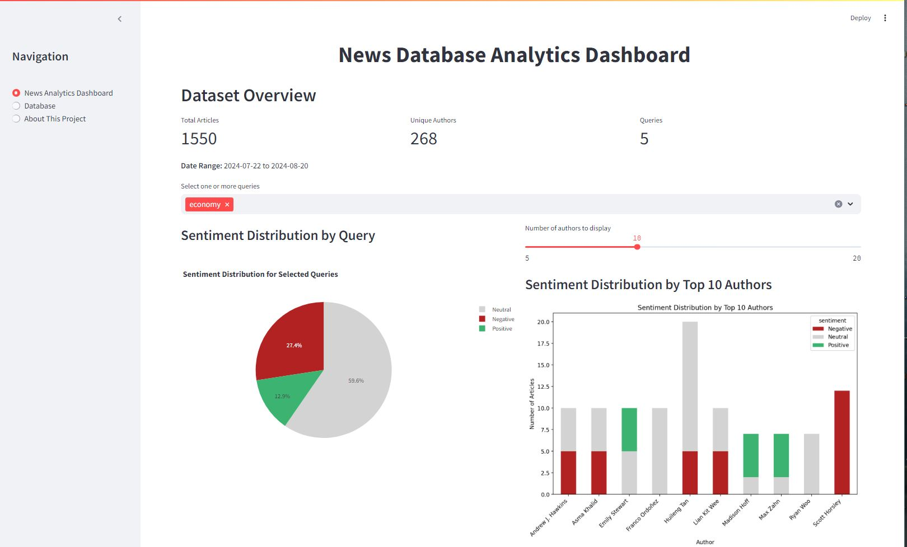
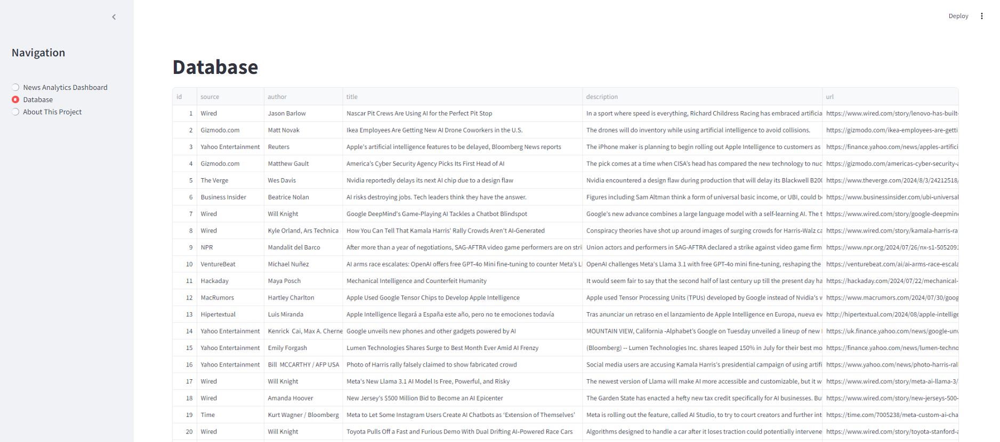
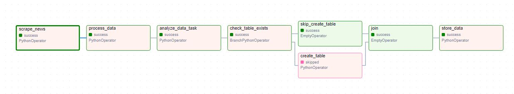
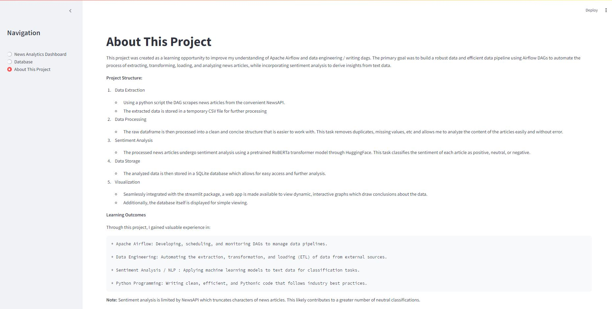

# News Analytics Dashboard with Airflow and Streamlit

This project is a comprehensive data pipeline that extracts, processes, analyzes, and visualizes news articles using Apache Airflow and Streamlit. The pipeline includes sentiment analysis using a pre-trained RoBERTa model and provides an interactive dashboard for exploring the results.

## Project Overview

### Key Features
- **Data Extraction**: Automated scraping of news articles using a custom Python script integrated with Airflow.
- **Data Processing**: Cleaning and structuring the data to ensure it is ready for analysis.
- **Sentiment Analysis**: Classifying the sentiment of news articles as positive, neutral, or negative using a pre-trained RoBERTa model.
- **Data Storage**: Storing the processed data in a SQLite database for efficient retrieval and analysis.
- **Visualization**: Interactive dashboards built with Streamlit to explore sentiment distributions and author analysis.

## Repository Structure

```
news-analytics-dashboard/
├── dags/
│   ├── news_analytics.py
│   ├── news.py
│   ├── sentiment_analysis.py
│   ├──streamlit_app.py
│   └──about_this_project.txt
├── .gitignore
├── README.md
├── hf_cache/
│   └── (Hugging Face cache)
├── docker-compose.yaml
├── Dockerfile
├── images/
│   ├── News_Analytics_Dashboard_FrontPage.JPG
│   ├── Database_page.JPG
│   ├── dag_image.JPG
│   └── About_this_project_page.JPG
```

## Prerequisites

- **Docker**: Ensure Docker is installed on your system.
- **Python**: Python 3.7 or higher is required.
- **pip**: Python package installer.

## Installation

1. **Clone the repository**:
   ```bash
   git clone https://github.com/willbrooker/news-analytics-dashboard.git
   cd news-analytics-dashboard
   ```

2. **Build Docker image**:
   Add the following to your `Dockerfile`:
   ```dockerfile
   FROM apache/airflow:2.9.3
   RUN pip install torch transformers tensorflow tf-keras matplotlib
   ```

3. **Run Docker Container**:
   ```bash
   docker-compose up -d
   ```
   Access the Airflow web interface at `http://localhost:8080`.

4. **Run Streamlit app**:
   ```bash
   streamlit run streamlit_app.py
   ```
   The Streamlit dashboard will be available at [http://localhost:8501](http://localhost:8501).

## Usage

### Airflow
- **DAGs**: The DAGs can be monitored, triggered, and scheduled via the Airflow web interface.
- **Logs**: Airflow logs can be found in the `logs/` directory.

### Streamlit Dashboard
- **Interactive Visualizations**: Explore sentiment distributions and author analysis through the Streamlit dashboard.
- **Filters**: Apply filters to customize the data displayed in the dashboard.

## About This Project

This project was created as a learning opportunity to improve my understanding of Apache Airflow and data engineering, specifically writing DAGs. The primary goal was to build a robust and efficient data pipeline using Airflow DAGs to automate the process of extracting, transforming, loading, and analyzing news articles, while incorporating sentiment analysis to derive insights from text data.

## Screenshots

### Dashboard Front Page


### Database Page


### Airflow DAG


### About Page

